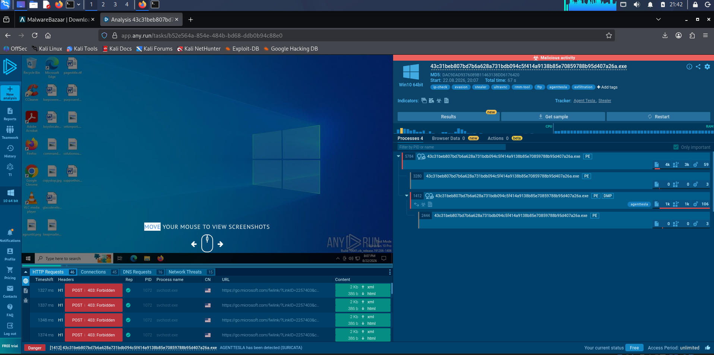
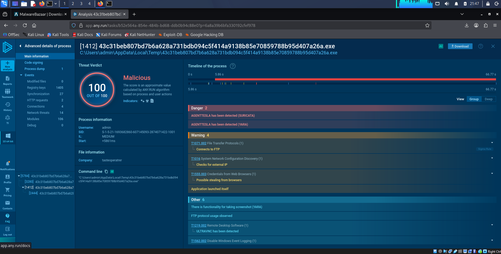
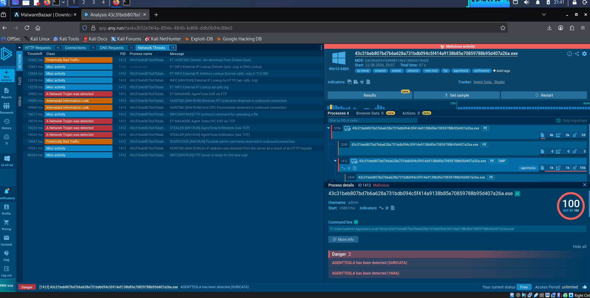
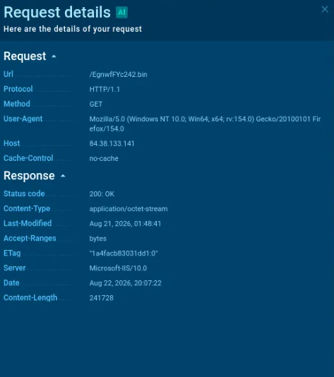

# Malware Analysis Report — NSIS-Wrapped AgentTesla Stealer

## Executive Summary

I analyzed a Windows executable that turned out to be an NSIS installer wrapping an AgentTesla information stealer. The infection chain is fairly typical of this family: the NSIS installer unpacks itself in `%TEMP%`, reassembles a payload that had been split across several oddly-named files inside the archive, pulls down a second-stage binary from an external server, checks the machine's public IP, grabs system and credential information, and ships it out over FTP. Both Suricata (network) and YARA (static/behavioral) signatures independently flagged it as AgentTesla, and the sample also carries UltraVNC-related capability — a common optional module in AgentTesla builds that gives the attacker a remote-access fallback beyond just credential theft.

## Sample Metadata

| Field | Value |
|---|---|
| Filename | `43c31beb807bd7b6a628a731bdb094c5f414a9138b85e70859788b95d407a26a.exe` |
| SHA256 | `43c31beb807bd7b6a628a731bdb094c5f414a9138b85e70859788b95d407a26a` |
| MD5 | `DAC9DAD9376089B11463138DD6176420` |
| File type | Windows PE executable, NSIS installer wrapper |
| Sandbox | any.run, Windows 10 64-bit |
| Detonation time | 2026-08-22 20:07 UTC |
| Total runtime | 67 seconds |
| Verdict | Malicious — AgentTesla (Suricata + YARA) |
| Sandbox tags | ip-check, evasion, stealer, ultravnc, rmm-tool, ftp, agenttesla, exfiltration |



## Static Analysis

I did this part on Kali using `file`, `sha256sum`, `strings`, and 7-Zip (which happens to understand NSIS archives directly).

**Identifying the file:** `file` calls it a PE32 executable — specifically a Nullsoft Installer self-extracting archive with 5 sections. The embedded manifest confirms it was built with Nullsoft Install System v3.08.

**Imports:** Nothing unusual here — just the standard set of Windows API DLLs (`ADVAPI32.dll`, `SHELL32.dll`, `ole32.dll`, `COMCTL32.dll`, `USER32.dll`, `GDI32.dll`, `KERNEL32.dll`). Worth noting: no HTTP or URL strings show up anywhere in the outer installer stub. That tells you the actual C2/network config isn't sitting in plaintext at this layer — it's buried inside the encrypted payload fragments described below.

**What's inside the NSIS archive** (`7z l`):

| File | Size (bytes) | Assessment |
|---|---|---|
| `$PLUGINSDIR/nsDialogs.dll` | 4,382 | Stock NSIS plugin (UI dialogs) — legitimate |
| `$PLUGINSDIR/System.dll` | 6,715 | Stock NSIS plugin (lets NSIS scripts call raw Windows API) — legitimate |
| `Deportationen` | 121,289 | No extension; meaningless filename |
| `arbejdskraftreserver.mis` | 124,897 | Danish for "workforce reserve"; `.mis` isn't a real extension |
| `Krystalglasset` | 44,395 | Danish for "crystal glass"; no extension |
| `beware.naz` | 187,910 | `.naz` isn't a real extension either |
| `Superreward/forkortelseslister.udv` | 217,740 | Danish for "abbreviation list"; `.udv` extension |
| `Superreward/telephonic.slg` | 258,482 | `.slg` extension |

**A correction I need to make:** earlier in this analysis, I flagged `System.dll` as a malicious file trying to pass itself off as a legitimate system component (mapped to T1036.005). That was wrong. Once I actually looked inside the NSIS archive, it's clear `System.dll` and `nsDialogs.dll` are just the standard plugins that ship with any NSIS-built installer — nothing attacker-introduced about them. Leaving this note in rather than quietly fixing it, since that's a useful reminder that sandbox tags need to be verified against the actual file, not taken at face value.

**Where the real masquerading is:** the other six files. Random Danish words, no meaningful extensions, no relationship between the filename and what's actually inside them — that's a deliberate choice, not an accident. My read is that these are encrypted fragments of the actual AgentTesla payload, split up and disguised so nothing about the archive listing gives away what's really in there, then reassembled and decrypted by the NSIS script at runtime. That would also explain the ~5.8 second gap between the installer launching (PID 5784) and the actual AgentTesla process starting (PID 1412) — plausible time spent stitching these pieces back together. Combined, the six non-plugin files add up to roughly 913 KB.

## Dynamic Analysis

### Process Tree

| PID | Score | Start Offset | Role |
|---|---|---|---|
| 5784 | 100/100 Malicious | +0ms | Initial NSIS-launched process |
| 3280 | — | — | Child process spawned by 5784 |
| 1412 | 100/100 Malicious | +5861ms | Core AgentTesla process — flagged by Suricata and YARA |
| 2444 | 0/100 No verdict | +9844ms | Spawned process, nothing suspicious observed |

All four run out of `C:\Users\admin\AppData\Local\Temp\`, which lines up with normal NSIS self-extraction behavior.

### PID 5784 — Initial Process

- Drops files into the Temp directory during self-extraction. (As noted above, one of those — `System.dll` — is a legitimate NSIS plugin, not a malicious artifact; the real obfuscation is in the six oddly-named payload fragments.)
- Reads the computer name and checks installed language support — basic system discovery
- Re-launches itself
- Compiled with English language support

### PID 1412 — Core AgentTesla Process



This is the process that actually does the damage. Both a network-level Suricata rule and a static/memory YARA signature independently called it as AgentTesla.

What it does:
- Connects out over FTP to exfiltrate data
- Checks its own external IP (fingerprinting the host/network)
- Shows behavior consistent with pulling saved credentials out of browsers
- **Carries UltraVNC** — this was confirmed by YARA directly, not just a loose sandbox tag, so it's a real capability in the binary, not a guess
- Disables Windows trace/event logging — a straightforward anti-forensics move
- Reads the machine GUID, Internet Explorer security settings, computer name, and language settings from the registry
- Has screenshot-capture functionality built in, per YARA



### Timeline

| Time | Event |
|---|---|
| 0ms | Installer (PID 5784) launches from Temp |
| ~5861ms | Core AgentTesla process (PID 1412) starts |
| 10262ms | Downloads stage-2 payload `EgnwfFYc242.bin` (241,728 bytes) from `84.38.133.141` |
| 12831–13278ms | External IP lookup via `api.ipify.org` (DNS, TLS SNI, and HTTP all hit) |
| 16473ms | Opens FTP control connection to `ftp.holzbrenzii.com` (198.27.80.139:21) |
| 18514ms | Opens FTP data connection (198.27.80.139:58038) |
| 18982ms | FTP exfiltration trips the AgentTesla Suricata signature |
| 18985ms | Windows hostname shows up in outbound traffic |
| 18990ms | CPU enumeration data shows up in outbound traffic |
| 19017ms | FTP upload command sent |
| 19019–19022ms | More AgentTesla exfil signatures fire (CnC exfil via TCP, raw TCP exfil) |
| 19047ms | Possible admin username spotted in outbound traffic |
| 73221–80064ms | More FTP session activity (server signals it's ready for a new user) |

**On the "two exfil channels" question:** the FTP transfer around the 19-second mark triggered both an FTP-specific signature and a raw-TCP AgentTesla exfil signature almost simultaneously. My read is that's the same FTP data transfer getting caught by more than one overlapping Suricata rule, rather than genuine evidence of a second, separate exfiltration channel. Either way, the actual amount of data sent out was tiny — 447 bytes — which fits a compact credential/system-info dump much better than any kind of bulk file theft.

### Network Connections



| Time | Destination IP | Port | Domain | ASN / Host | Purpose |
|---|---|---|---|---|---|
| 10272ms | 84.38.133.141 | 80 | — | DATACLUB-NL | Stage-2 payload download |
| 13372ms | 172.67.74.152 | 443 | api.ipify.org | CLOUDFLARENET | External IP fingerprinting |
| 16473ms | 198.27.80.139 | 21 | ftp.holzbrenzii.com | OVH (France) | FTP control channel |
| 18514ms | 198.27.80.139 | 58038 | ftp.holzbrenzii.com | OVH (France) | FTP data channel — exfiltration |

Everything else on the wire (login.live.com, settings-win-data.microsoft.com, ocsp.digicert.com, crl.microsoft.com, www.microsoft.com, licensing.mp.microsoft.com, slscr.update.microsoft.com, fe3cr.delivery.mp.microsoft.com, client.wns.windows.com, google.com) is normal Windows OS/telemetry traffic — I've left it out of the malicious-activity picture since it has nothing to do with the malware.

### DNS Resolution

- `ftp.holzbrenzii.com` → `198.27.80.139` (unverified reputation at time of analysis)
- `api.ipify.org` → `172.67.74.152`, `104.26.12.205`, `104.26.13.205`

### User-Agent Strings

Two different, fabricated Firefox user-agent strings show up across the malware's traffic:

- `Mozilla/5.0 (Windows NT 10.0; Win64; x64; rv:154.0) Gecko/20100101 Firefox/154.0` — used when pulling the stage-2 `.bin`. Firefox 154 doesn't exist, which makes this a solid, low-noise detection signature on its own.
- `Mozilla/5.0 (Windows NT 10.0; Win64; x64; rv:99.0) Gecko/20100101 Firefox/99.0` — used for the ipify.org check.

Two different fabricated versions across two requests suggests the malware is generating these strings from more than one internal code path, rather than reusing a single hardcoded value everywhere.

## Indicators of Compromise

| Indicator | Type | Context |
|---|---|---|
| `43c31beb807bd7b6a628a731bdb094c5f414a9138b85e70859788b95d407a26a` | SHA256 | Parent NSIS-wrapped AgentTesla sample |
| `DAC9DAD9376089B11463138DD6176420` | MD5 | Parent sample |
| `84.38.133.141` | IP | Stage-2 payload host (DATACLUB-NL) |
| `EgnwfFYc242.bin` | Filename | Stage-2 payload, 241,728 bytes, served via IIS 10.0 |
| `ftp.holzbrenzii.com` | Domain | Exfiltration FTP server |
| `198.27.80.139` | IP | Exfiltration FTP server (OVH, France) — ports 21 & 58038 |
| `Deportationen`, `arbejdskraftreserver.mis`, `Krystalglasset`, `beware.naz`, `forkortelseslister.udv`, `telephonic.slg` | Filenames | Fragmented/disguised payload files inside the NSIS archive |
| `Mozilla/5.0 (Windows NT 10.0; Win64; x64; rv:154.0) Gecko/20100101 Firefox/154.0` | User-Agent | Spoofed UA, non-existent Firefox version |
| `Mozilla/5.0 (Windows NT 10.0; Win64; x64; rv:99.0) Gecko/20100101 Firefox/99.0` | User-Agent | Spoofed UA |

## MITRE ATT&CK Mapping

| Technique ID | Technique | Evidence |
|---|---|---|
| T1027.002 | Software Packing | Payload split into encrypted fragments inside the NSIS archive |
| T1036.005 | Match Legitimate Resource Name or Location | Payload fragments given innocuous/randomized names and fake extensions (e.g. `beware.naz`, `arbejdskraftreserver.mis`) |
| T1012 | Query Registry | Machine GUID, IE security settings, computer name |
| T1082 | System Information Discovery | Hostname, language settings, CPU enumeration |
| T1016 | System Network Configuration Discovery | External IP check via ipify.org |
| T1614 | System Location Discovery | External IP-based geolocation check |
| T1105 | Ingress Tool Transfer | Stage-2 `.bin` pulled from 84.38.133.141 |
| T1555.003 | Credentials from Web Browsers | Browser credential theft behavior |
| T1219.002 | Remote Desktop Software | UltraVNC capability, confirmed via YARA |
| T1562.002 | Disable Windows Event Logging | Trace/event log disabling observed |
| T1071.002 | Application Layer Protocol: File Transfer Protocols | FTP used for C2/exfil |
| T1041 | Exfiltration Over C2 Channel | Credential/system data sent out via FTP |

## Detection and Prevention Recommendations

- Block `198.27.80.139` and `84.38.133.141`, and blocklist `ftp.holzbrenzii.com` at the DNS/web filtering layer.
- Watch for outbound FTP connections coming from processes running out of `%TEMP%` or other user-writable folders — legitimate FTP use almost never originates that way.
- Monitor for DLL or system-sounding filenames being written to `%TEMP%` by non-installer processes.
- Alert on attempts to disable Windows event logging from user-context processes (T1562.002) — this is a strong anti-forensics signal on its own, worth a high-confidence detection rule.
- Flag outbound HTTP traffic using implausible or malformed User-Agent strings (like a browser version that doesn't exist) — cheap to detect and a decent signal.
- Treat any executable carrying UltraVNC/remote-desktop capability that wasn't deployed by IT as high risk — it's dual-use, and in this context it's clearly there to give the attacker a fallback access method, not for legitimate remote support.

## YARA Rule

Built from what showed up in both the static (NSIS archive contents) and dynamic (C2 infrastructure, spoofed UAs) analysis above. It's meant to run against the installer itself — I haven't validated it against the unpacked payload yet, since that would need decompiling the reassembled payload (`ilspycmd`/dnSpy, assuming it's .NET) to pull out mutex names or config strings, which I'm treating as a follow-up task rather than something to guess at here.

```yara
rule AgentTesla_NSIS_Wrapped_20260822
{
    meta:
        description   = "Detects the NSIS-wrapped AgentTesla sample analyzed 2026-08-22 and its known infrastructure/network artifacts"
        author         = "malware-analysis-portfolio"
        date           = "2026-08-22"
        malware_family = "AgentTesla"
        reference      = "any.run task b52e564a-854e-484b-bd68-ddb0b94c88e0"
        sha256         = "43c31beb807bd7b6a628a731bdb094c5f414a9138b85e70859788b95d407a26a"
        md5            = "DAC9DAD9376089B11463138DD6176420"

    strings:
        // Embedded NSIS archive entries: fragmented/obfuscated payload filenames
        // (non-semantic, foreign-language names paired with non-standard extensions)
        $frag1 = "Deportationen" ascii wide
        $frag2 = "arbejdskraftreserver.mis" ascii wide
        $frag3 = "Krystalglasset" ascii wide
        $frag4 = "beware.naz" ascii wide
        $frag5 = "forkortelseslister.udv" ascii wide
        $frag6 = "telephonic.slg" ascii wide

        // NSIS build marker
        $nsis_marker  = "Nullsoft.NSIS.exehead" ascii wide

        // Stage-2 payload filename and hosting infrastructure
        $stage2_file  = "EgnwfFYc242.bin" ascii wide
        $stage2_ip    = "84.38.133.141" ascii wide

        // Exfiltration infrastructure
        $exfil_domain = "ftp.holzbrenzii.com" ascii wide
        $exfil_ip     = "198.27.80.139" ascii wide

        // Spoofed user-agent strings observed in C2/staging traffic
        // (non-existent Firefox version is a strong, low-FP indicator)
        $ua_bin_dl    = "Mozilla/5.0 (Windows NT 10.0; Win64; x64; rv:154.0) Gecko/20100101 Firefox/154.0" ascii wide
        $ua_ipcheck   = "Mozilla/5.0 (Windows NT 10.0; Win64; x64; rv:99.0) Gecko/20100101 Firefox/99.0" ascii wide

    condition:
        // Match on file identity (exact known sample)
        uint16(0) == 0x5A4D and filesize < 5MB and
        (
            // Direct hash match for this exact sample
            hash.sha256(0, filesize) == "43c31beb807bd7b6a628a731bdb094c5f414a9138b85e70859788b95d407a26a"
            or
            // OR generic detection: NSIS wrapper containing 3+ of the known
            // fragmented-payload filenames or infrastructure/UA indicators
            ( $nsis_marker and 3 of ($frag1, $frag2, $frag3, $frag4, $frag5, $frag6,
                                       $stage2_file, $stage2_ip, $exfil_domain, $exfil_ip,
                                       $ua_bin_dl, $ua_ipcheck) )
        )
}
```

**A few notes on this rule:**
- The `hash.sha256` condition needs the YARA `hash` module — add `import "hash"` at the top of your rule file if you're running this standalone.
- The fragment-filename strings (`$frag1`–`$frag6`) are the strongest indicators here, since they come straight from the archive listing and won't break if the campaign rotates its C2 infrastructure — assuming whoever's building these keeps reusing the same naming pattern.
- The infrastructure strings (the FTP domain, the stage-2 IP, etc.) are much more perishable — treat them as specific to this sample/campaign rather than something durable. A proper family-wide rule would need to come from packer or config-decryption patterns in the unpacked payload, which is still on the to-do list.
- Next logical step, if I pick this back up: pull each of the six fragment files out individually, check their entropy to confirm they're actually encrypted, and try decompiling the reassembled payload to get at the mutex name and hardcoded C2 config.
