[README.md](https://github.com/user-attachments/files/33185794/README.md)
# Detecting a Multi-Stage Man-in-the-Middle Attack with Splunk

## Overview

This is an analysis of a multi-stage Man-in-the-Middle (MITM) attack reconstructed from network logs ingested into Splunk. The attack chains three techniques — ARP cache poisoning, DNS spoofing, and SSL stripping — to intercept a victim's traffic and ultimately capture login credentials in cleartext.

The goal of this writeup is to show the detection methodology: how each stage leaves a distinct fingerprint in the logs, the SPL used to surface it, and the reasoning that ties the stages into a single attack narrative.

**Environment**
- Log source: network capture ingested to `index=network_logs`, `sourcetype=mitm_attack`
- Key fields: `protocol`, `type`, `src_ip`, `dst_ip`, `src_mac`, `dst_mac`, `info`
- Note: the `info` field is URL-encoded (`%20` = space), so domain matches use wildcards.

**Actors**

| Role | IP | MAC |
|---|---|---|
| Gateway (legitimate) | 192.168.10.1 | 02:aa:bb:cc:00:01 |
| Attacker | 192.168.10.55 | 02:fe:fe:fe:55:55 |
| Victim | 192.168.10.10 | 02:aa:bb:14:b6:8b |
| Legitimate DNS | 8.8.8.8 | — |

---

## Stage 1 — ARP Cache Poisoning

**Hypothesis:** the attacker is forging ARP replies to associate its own MAC with the gateway's IP, inserting itself into the path between victim and gateway.

**Baseline — ARP request vs reply volume**
```spl
index=network_logs protocol=ARP
| stats count by type
```
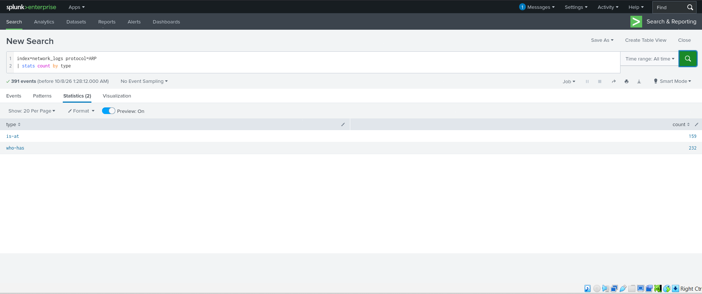

232 `who-has` vs 159 `is-at`. A high reply count relative to requests is the first hint of unsolicited (gratuitous) replies.

**Confirming the attacker out-talks the real gateway**
```spl
index=network_logs protocol=ARP type="is-at" src_ip="192.168.10.1"
| stats count by src_mac
| sort -count
```


The attacker MAC issues more `is-at` replies (14) than the real gateway (10) — the attacker must continuously re-assert the poisoned mapping to keep the victim's ARP cache corrupted.

**The key evidence — one IP claimed by two MACs**
```spl
index=network_logs protocol=ARP type="is-at" src_ip="192.168.10.1"
| stats dc(src_mac) as mac_count values(src_mac) as macs count by src_ip
```
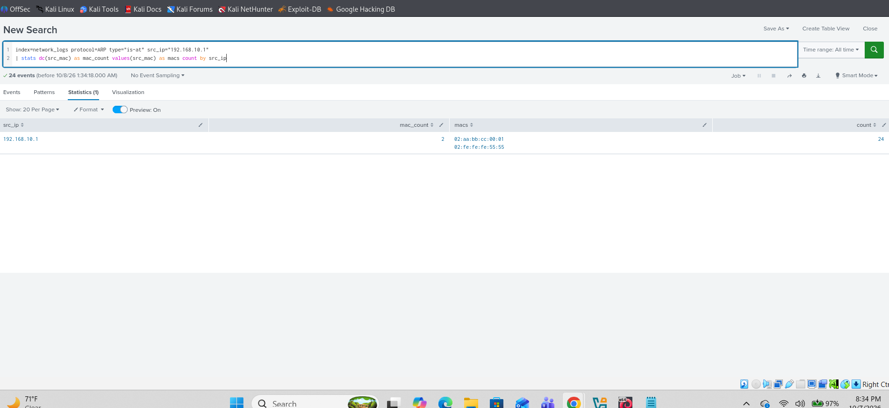

The gateway IP `192.168.10.1` resolves to **two** MACs: the legitimate `02:aa:bb:cc:00:01` and the attacker's `02:fe:fe:fe:55:55`. A single IP mapping to multiple MACs is the defining signature of ARP cache poisoning.

**Verifying no other host is affected**
```spl
index=network_logs protocol=ARP type="is-at"
| stats dc(src_mac) as mac_count values(src_mac) as mac_list by src_ip
| where mac_count > 1
```
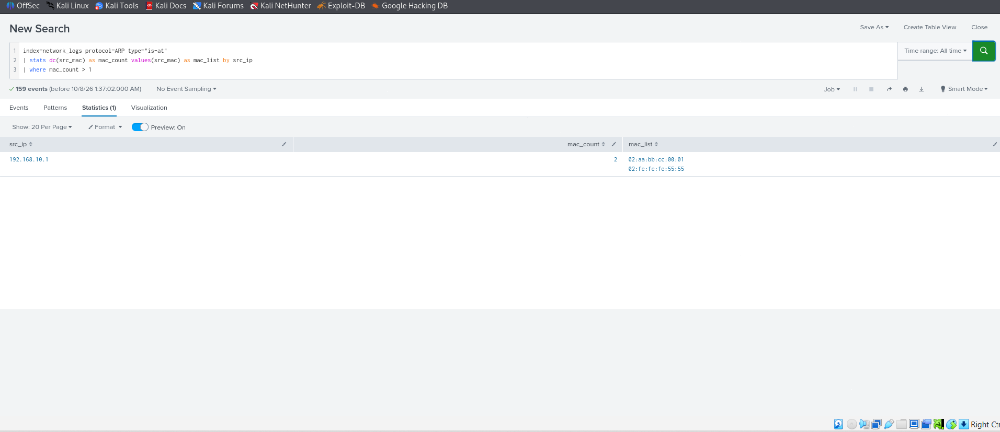

Only `192.168.10.1` shows duplicate MACs, scoping the attack to gateway impersonation specifically.

**Gratuitous ARP replies**
```spl
index=network_logs protocol=ARP type="is-at"
| where src_ip==dst_ip
| stats count by src_mac src_ip
```
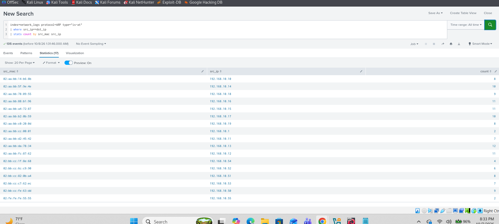

Gratuitous (unsolicited) replies — where the sender announces its own IP without being asked — are a normal part of some traffic, but repeated gratuitous replies tying the gateway IP to the attacker MAC are consistent with an attacker keeping the poisoned mapping alive.

**Timeline of the ARP replies**
```spl
index=network_logs protocol=ARP type="is-at" src_ip="192.168.10.1"
| timechart span=1m count by src_mac
```
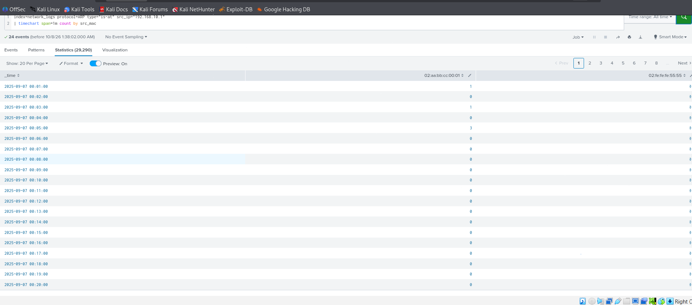

Charting the gateway's `is-at` replies per minute, split by MAC, separates the legitimate gateway's steady low-rate replies from the attacker's concentrated bursts.

**Why it matters:** controlling the gateway mapping means all of the victim's outbound traffic — including DNS queries — now flows through the attacker. That sets up Stage 2.

---

## Stage 2 — DNS Spoofing

**Hypothesis:** with traffic flowing through them, the attacker forges DNS responses for `corp-login.acme-corp.local` to redirect the victim to an attacker-controlled host.

**DNS query vs response volume**
```spl
index=network_logs protocol=DNS
| stats count by type
```


754 queries and 755 responses. One response more than there are queries is a small but telling anomaly — an extra, unsolicited answer is exactly what a spoofer injects.

**Baseline — legitimate responses from the real resolver**
```spl
index=network_logs protocol=DNS type=response src_ip=8.8.8.8
```
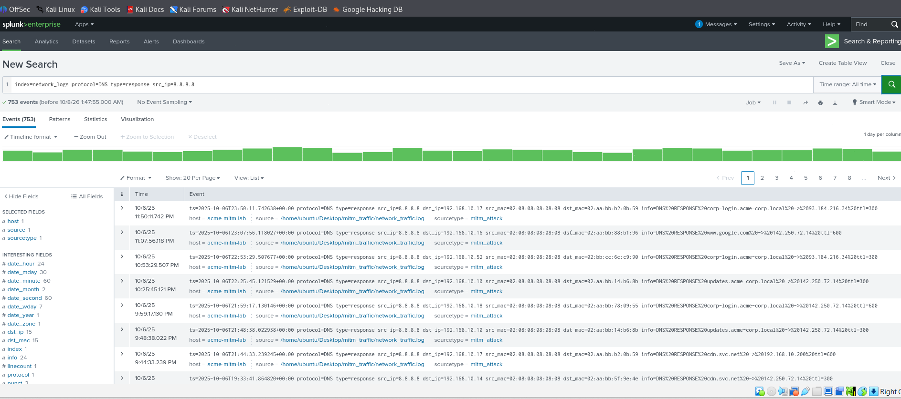

753 responses from `8.8.8.8`, all carrying the resolver's expected MAC. This is what normal resolution looks like, for comparison.

**The key evidence — responses from an unexpected source**
```spl
index=network_logs protocol=DNS type=response
| stats count by src_ip
| sort -count
```
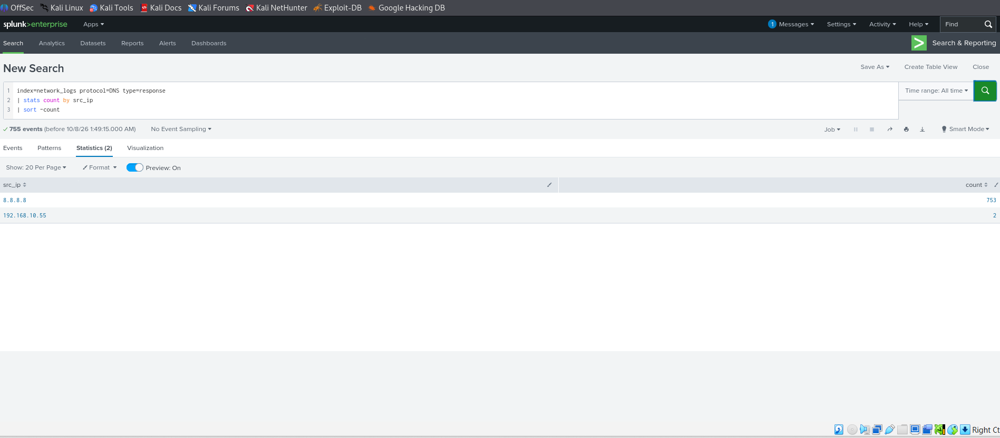

753 legitimate responses from `8.8.8.8`, and **2** from `192.168.10.55`. A host on the local subnet answering DNS is not normal — that's a rogue resolver.

**Normal resolution for the target domain**
```spl
index=network_logs protocol=DNS info="*corp-login.acme-corp.local*"
| table _time type src_ip dst_ip src_mac info
```
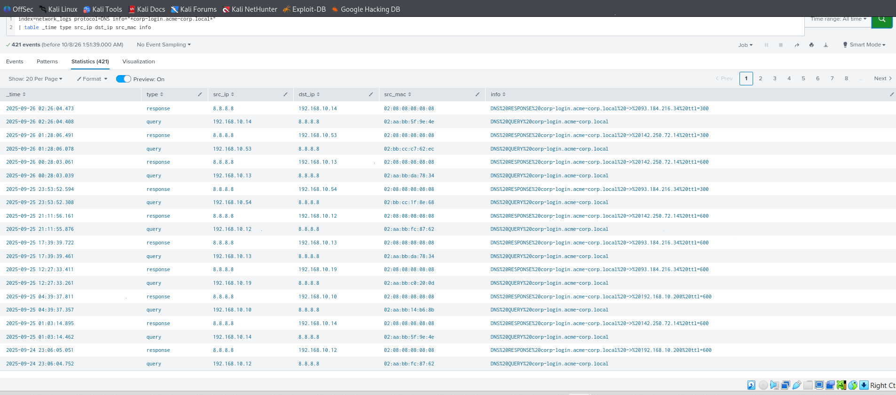

The normal query/response pairs for the domain, resolved through `8.8.8.8` to its real public IP.

**Isolating the forged responses**
```spl
index=network_logs protocol=DNS type=response info="*corp-login.acme-corp.local* src_ip!=8.8.8.8 "
| table _time src_ip dst_ip info
```
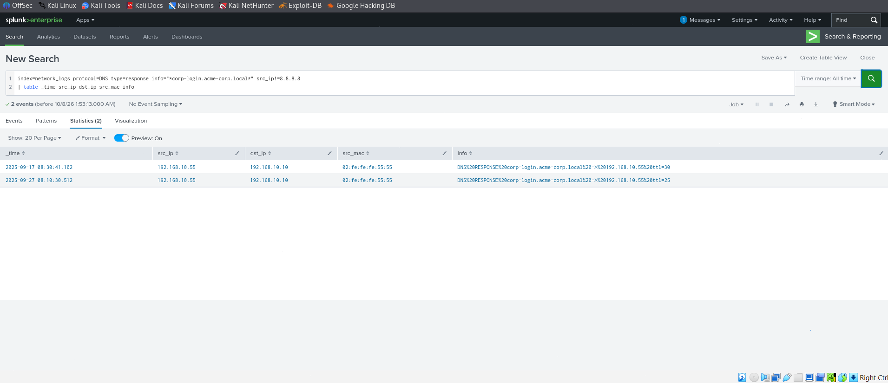

Two spoofed responses sent to the victim (`192.168.10.10`), resolving the domain to `192.168.10.55` — the attacker's own IP — with unusually short TTLs (30 and 25 seconds). Short TTLs are themselves a tell: they force frequent re-queries so the spoof stays fresh.

**Why it matters:** the victim now believes the login portal lives at the attacker's machine. Note the same MAC (`02:fe:fe:fe:55:55`) drives both the ARP poisoning and the DNS forgery — one actor, two techniques.

---

## Stage 3 — SSL Stripping & Credential Capture

**Hypothesis:** having redirected the victim, the attacker serves plain HTTP instead of HTTPS, downgrading the connection so credentials travel in cleartext.

**Baseline — the portal normally uses TLS**
```spl
index=network_logs protocol=TLS info="*corp-login.acme-corp.local*"
| table _time src_ip dst_ip info
```
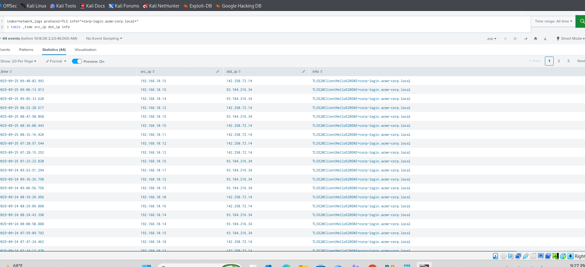

44 `ClientHello` events with `SNI=corp-login.acme-corp.local` to legitimate external IPs. The site is unambiguously an HTTPS service under normal conditions.

**Full TLS handshakes complete normally**
```spl
index=network_logs protocol=TLS
| table _time src_ip dst_ip info
```
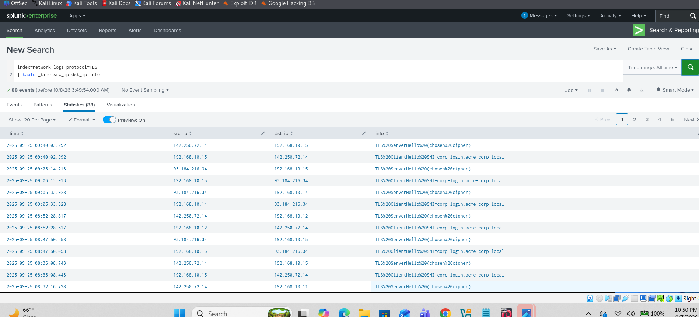

88 events showing `ClientHello` → `ServerHello (chosen cipher)` pairs. Under normal conditions the handshake negotiates fully, confirming real encrypted sessions were the baseline.

**The key indicator — TLS vanishes toward the attacker**
```spl
index=network_logs protocol=TLS dst_ip=192.168.10.55 info="*corp-login.acme-corp.local*"
| stats count
```


Count = **0**. The victim never negotiates TLS with the attacker. The absence is the evidence: a normally-HTTPS portal with zero handshakes to the host now serving it signals a downgrade.

**The payoff — plaintext HTTP to the attacker**
```spl
index=network_logs protocol=HTTP src_ip=192.168.10.10 dst_ip=192.168.10.55
| table _time src_ip dst_ip type info
| sort _time
```
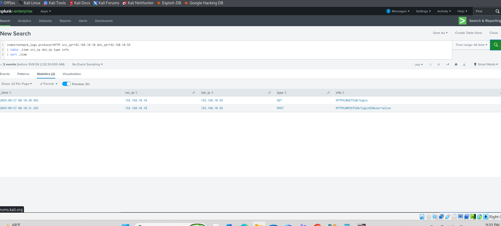

A `GET /login` followed by a `POST /login`, victim → attacker, over plain HTTP.

**Credential theft confirmed**
```spl
index=network_logs protocol=HTTP type=POST info="*login*"
```
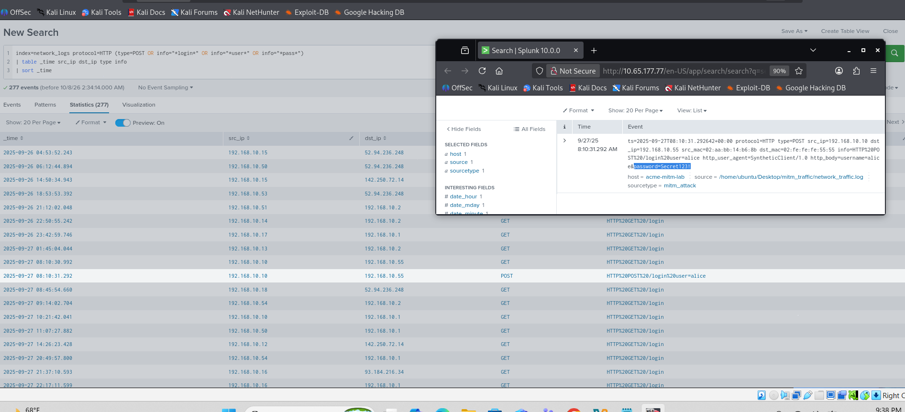

The POST body contains the username and password in cleartext — the captured credential. This is the attack's objective realized.

---

## The Full Attack Chain

All three stages correlate in one timeline:
```spl
index=network_logs (protocol=ARP type="is-at" src_ip="192.168.10.1")
  OR (protocol=DNS type=response src_ip=192.168.10.55 info="*corp-login.acme-corp.local*")
  OR (protocol=HTTP src_ip=192.168.10.10 dst_ip=192.168.10.55)
| table _time protocol type src_ip dst_ip src_mac info
| sort _time
```
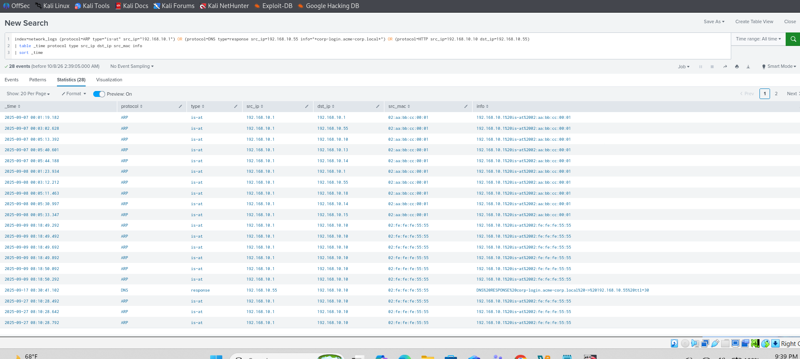
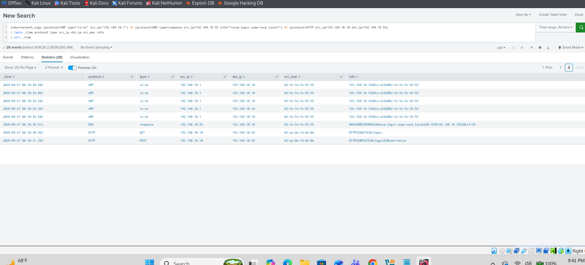

Within a ~4-second window the sequence is unmistakable:

| Time | Stage | Event |
|---|---|---|
| 08:10:28–29 | ARP | Attacker MAC floods `is-at` claiming the gateway |
| 08:10:30.512 | DNS | Forged response: domain → 192.168.10.55 (TTL 25) |
| 08:10:30.992 | HTTP | Victim `GET /login` to attacker (plaintext) |
| 08:10:31.292 | HTTP | Victim `POST /login` — credentials captured |

Each stage enables the next: poison the path, redirect the name, strip the encryption, read the password.

---

## Detection & Remediation

**Detection signals to alert on**
- Any IP resolving to more than one MAC (`dc(src_mac) > 1` per `src_ip`)
- DNS responses originating from inside the local subnet
- A host that normally shows TLS `ClientHello` traffic suddenly connecting over plain HTTP
- HTTP POST bodies containing credential-like fields

**Mitigations**
- **ARP:** enable Dynamic ARP Inspection (DAI) with DHCP snooping on switches; use static ARP entries for critical gateways.
- **DNS:** restrict DNS egress to approved resolvers; deploy DNSSEC where supported; alert on non-resolver hosts answering DNS.
- **SSL stripping:** enforce HSTS (ideally preloaded) so browsers refuse HTTP for the domain; disable plaintext HTTP on the portal entirely.
- **General:** network segmentation and 802.1X to limit an attacker's ability to sit on the same L2 segment as victims.
